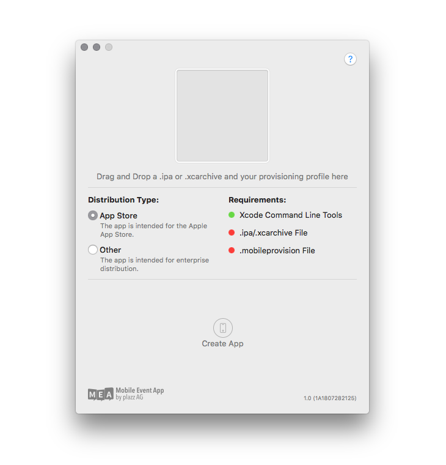
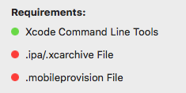

<div align="center">
<br><br>


[](https://github.com/plazzag/signing-tool/blob/master/LICENSE)

[](https://developer.apple.com/swift/)
</div>

# Mobile Event App Signing Tool

__Requirement__: macOS 10.13 High Sierra or higher

### Development Environment
* macOS 10.13 High Sierra
* Xcode 9.3
* Swift 4.1

## What is MEA Signing Tool?
**MEA Signing Tool** is a tool that allows you to simplify the manual signing processes of your custom **Mobile Event App** with your own Provisioning Profiles.

## Installing  MEA Signing Tool
There's two main ways to install **MEA Signing Tool**:

1. Download the [latest release](https://github.com/plazzag/signing-tool/releases), open the **SigningTool.pkg** and install the application to your `/Applications` folder.
2. Build it from source, but this is not recommended if your are only going to use **MEA Signing Tool** in the regular way. 

## Compile instructions

In order to compile the app to **macOS** you'll need an Apple Developer account. You can get yours at the [Apple Developer Portal](https://developer.apple.com). Below you'll find compile instructions.

**macOS**

- Download the project ZIP or clone this repo in your machine.
- Open the project on **Xcode**
- Enter the project config page by:
    - Clicking the project name just below Xcode window controls
    - Go to **General** tab and just below **Targets** you'll see one entry: `Signing Tool`. Make sure to select this entry. 
    - Under **Identity** you'll find a field named `Bundle Identifier`. Change it accordingly (i.e.: **com.yourName.signingtool**)
    - Under signing select your Team and, if `Automatically manage signing` is selected **Xcode** will handle signing
    - Everything should now be ready
- Build and run the app

## How does it work?

<p align="center">

</p>

With the **MEA Signing Tool** you have the possibility to sign the **Mobile Event App** by yourself. The tool supports already signed apps and unsigned Xcode archives of the **Mobile Event App**. This process is necessary if you want to distribute your event app through your own Apple Developer Account.

First of all you need your individual **Mobile Event App**, which you can get from our support team. You will receive either a **.ipa** or **.xcarchive** file that you can use with this tool.



After opening the **MEA Signing Tool**, it checks various preconditions. These requirements are indicated with a green or red status icon.

All requirements must be satisfied for the tool to be used properly. On startup, the Xcode Command Line Tools are searched for. If they are not installed, please install them.</p>

For the other two requirements drag and drop the corresponding files into the marked area inside the **MEA Signing Tool**.

If all requirements are fulfilled, the app can be signed by clicking "Create App". The bundle identifier of the iOS app is automatically adapted to the bundle identifier in the Provisioning Profile.

## Help

**Installing Command Line Tools in macOS**

1. Launch the Terminal, found in /Applications/Utilities/
2. Type the following command string: ```xcode-select --install```
3. A software update popup window will appear that asks: "The xcode-select command requires the command line developer tools. Would you like to install the tools now?" Confirm this by clicking "Install".

**Create and download a properly configured Provisioning Profile**

You can create and download your own Provisioning Profile from the [Apple Developer Portal](https://developer.apple.com). In order for this tool to be able to use the profile for signing, the appropriate Distribution Certificate must also be installed on the Keychain of your Mac. The Distribution Certificate consists of a public-private key pair that Apple creates for you. **The private key must be present in the Keychain!** If you do not have a distribution certificate yet, you can also create one in the [Apple Developer Portal](https://developer.apple.com).

The **Mobile Event App** needs an App ID configured to the following services:

* Data Protection: Protected Until First User Authentication
* Push Notifications: enabled
* Wallet: enabled

To do so proceed with the following steps:

1. Go to the [Apple Developer Portal](https://developer.apple.com). Log in Apple Developer Center, then click "Certificates, Identifiers & Profiles".
2. Create New App ID. Click "Identifiers" under iOS Apps. Click on the "+" sign near the top right corner to add a new App ID. In the next screen you will be asked to create the App ID you want to use as well as the description you want to give it.
3. Select App Services. In addition to what Apple selects on your behalf, add Data Protection, Push Notifications and Wallet as described above.
4. Register your App ID. Once you click "Continue", you will see the confirmation screen. Click "Submit" to create the app ID.

When your App ID is configured properly your can create a fresh Provisioning Profile with the following steps:

1. Go to the [Apple Developer Portal](https://developer.apple.com). Log in Apple Developer Center, then click "Certificates, Identifiers & Profiles".
2. On the left tab under Provisioning Profiles, select Distribution. Select add button "+" at the top right to create a new profile. Select "App Store" or "In House" and press Continue.
3. Select App ID and press "Continue".
4. Select the Distribution Certificate you wish to include in this provisioning profile (the certificate the app should signed with) and click "Continue".
5. Create a name for your profile and click "Generate".
6. Download the your profile to your Mac.

**Checklist**

In summary, here is a checklist with what you need:

* [ ] This **MEA Signing Tool**
* [ ] Your individual **Mobile Event App** .ipa or .xcarchive file 
* [ ] Your properly configured provisioning profile 
* [ ] Your distribution certificate including the private key with which the profile was created must be present in the keychain on your Mac
* [ ] Xcode Command Line Tools must be present on your Mac

## Known bugs
None at the moment.

## License

This project is licensed under the terms of the MIT license. See the [LICENSE](LICENSE) file.

The copying and use of the Mobile Event App logo, and, or, any other logos accessed via the project are not permitted without prior approval from the licensee or copyright owner. 
